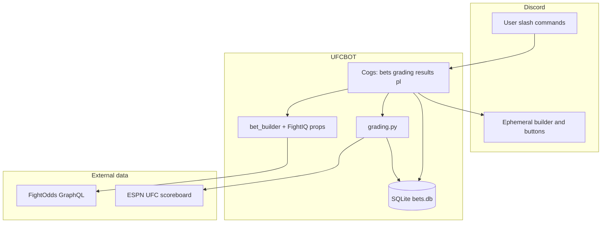
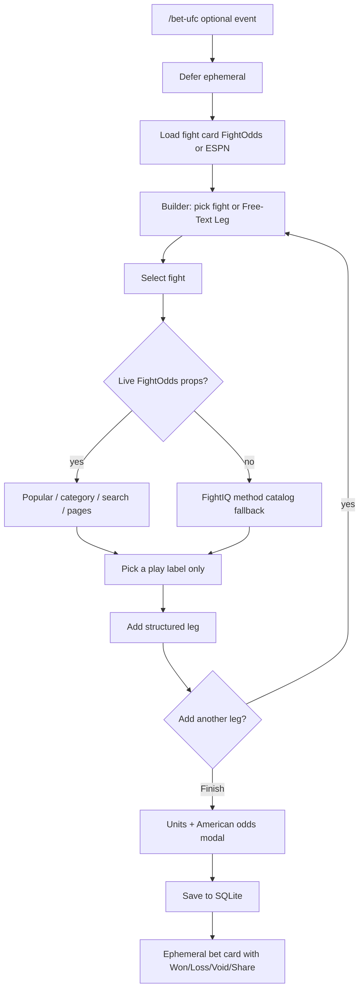
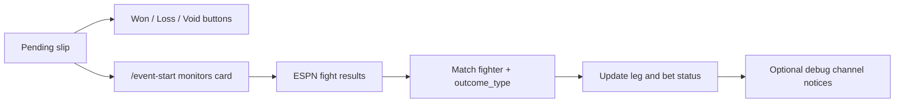

# UFCBOT — UFC (and NBA) Bet Tracker Discord Bot

Personal Discord bot for logging MMA/UFC betting slips, building structured props from live FightOdds markets, settling wins/losses (manually or via ESPN auto-grade), and tracking profit/loss with real American-odds math.

Access is restricted to allow-listed Discord user IDs. Each user’s bets are isolated.

---

## What it does

| Area | Capability |
|------|------------|
| **Log bets** | Interactive `/bet-ufc` builder (fight → prop → units/odds) or free-text legs; simpler `/bet-nba` for NBA |
| **Markets** | Live FightOdds props via FightIQ (methods, rounds, O/U, distance, etc.) — **labels only** in Discord (you enter your own odds) |
| **Settle** | Persistent Won / Loss / Void buttons; share slips to channels; optional ESPN auto-grading |
| **Recaps** | Event card view, P/L charts, visual spread-sheet image, XLSX-style recaps |
| **Results** | All-time or per-event records with net units and W-L-V |

---

## High-level architecture



---

## `/bet-ufc` flow (primary)

The builder message is **ephemeral** (only you see fight/prop selects). After you finish, the logged bet card is also ephemeral; use **Share** to post publicly.



**Structured legs** store `fighter_pick`, `outcome_type` (e.g. `ML`, `SUB`, `R_2`, `OVER_2_5`), and optional `outcome_round` so ESPN auto-grading can settle them later.

---

## Settling and auto-grading



- **Manual**: buttons on the bet card (owner only).
- **Auto**: `/event-start` watches an event; as fights finish on ESPN, matching structured legs are graded (method/round/totals/distance rules in `grading.py`).
- **Correct**: `/regrade-event` re-checks ESPN and fixes mistaken settles.
- Free-text legs without structure stay pending until you grade them manually (or rematch tools structure them later).

---

## Commands

### Betting

| Command | Description |
|---------|-------------|
| `/bet-ufc` | Interactive UFC slip builder (straight / multi-leg / parlay). Optional `event` autocomplete from upcoming cards. |
| `/bet-nba` | Log an NBA bet (free-text style legs). |
| `/unit-size` | Set how much one unit is worth in your currency. |
| `/delete-event` | Permanently delete all of **your** tracked UFC bets for one event. |
| `/card` | List every UFC bet you’ve logged for a card. |
| `/spread-sheet` | Generate a visual recap image of your bets for an event. |

### Results and P/L

| Command | Description |
|---------|-------------|
| `/results-ufc all-time` | All-time UFC results summary. |
| `/results-ufc select-event` | Results for one event you’ve bet. |
| `/results-nba` | All-time NBA results. |
| `/pl` | Profit/loss overall or for one event (with chart). |

### Grading

| Command | Description |
|---------|-------------|
| `/grade` | Manually grade a pending UFC slip (by id or picker). |
| `/regrade-event` | Re-fetch ESPN results and correct grades for an event. |
| `/event-start` | Start auto-grading a UFC event as fights finish. |
| `/event-end` | Stop auto-grading one event (or all if blank). |

---

## Bet card actions

After logging, each slip has persistent buttons:

- **Won / Loss / Void** — settle the slip (American-odds P/L applied when odds were set)
- **Share** — post a public copy to a channel (this server or another the bot is in)
- **Delete** — remove the slip (owner only)

Views are re-registered on startup so buttons keep working after a restart.

---

## Profit math (American odds)

Logic lives in `betting_math.py`:

| Result | Odds | Profit |
|--------|------|--------|
| Won | Favorite (e.g. `-150`) | `units × (100 / \|odds\|)` |
| Won | Underdog (e.g. `+120`) | `units × (odds / 100)` |
| Won | No odds | `+units` (flat) |
| Loss | any | `-units` |
| Void | any | `0` |

Currency and unit value are per user (`/unit-size` + config).

---

## FightIQ integration

The `FightIQ/` package powers prop discovery:

1. Resolve fight **slug** from the FightOdds card.
2. Load `fightPropOfferTable` (popular / category / search) — **odds are not shown** in Discord.
3. If FightOdds hasn’t posted props yet, fall back to FightIQ’s method catalog (ML, KO/SUB/DEC/ITD, rounds, O/U, distance, etc.).
4. Selected plays map to structured `outcome_type` values for auto-grading.

You still enter **your** book odds in the Finish modal.

---

## Project layout

```
UFCBOT/
├── bot.py                 # Entry: Discord client, cog load, event cache loop
├── config.py              # .env + allow-list / currency settings
├── database.py            # SQLite (bets, legs, monitored events)
├── bet_builder.py         # Ephemeral /bet-ufc UI
├── props_loader.py        # FightIQ catalog load + method fallback
├── prop_play_map.py       # Play → structured leg (no odds)
├── grading.py             # ESPN vs structured outcome rules
├── card_data.py           # Upcoming events + fight cards (FightOdds / ESPN)
├── client.py              # FightOdds GraphQL client
├── espn.py                # ESPN scoreboard / results
├── embeds.py / views.py   # Bet cards, share pickers, buttons
├── betting_math.py        # American odds P/L
├── cogs/
│   ├── bets.py            # /bet-ufc, /bet-nba, card, spread-sheet, …
│   ├── grading.py         # /grade, /event-start, auto loops
│   ├── results.py         # /results-ufc
│   ├── results_nba.py     # /results-nba
│   └── pl.py              # /pl
├── FightIQ/               # Prop catalog toolkit (imported at runtime)
├── requirements.txt
└── README.md
```

---

## Setup

### 1. Discord application

1. [Discord Developer Portal](https://discord.com/developers/applications) → New Application → Bot → copy token.
2. Privileged intents are **not** required (slash commands + components only).
3. OAuth2 URL Generator: scopes `bot` + `applications.commands`; permissions **Send Messages**, **Embed Links**, **Read Message History**, **Attach Files** (for recap images).

### 2. Environment

Create a `.env` in the project root (never commit it):

```env
DISCORD_TOKEN=your_bot_token_here
GUILD_ID=your_server_id_optional
DB_PATH=bets.db
EVENT_REFRESH_HOURS=72
```

| Variable | Required | Notes |
|----------|----------|--------|
| `DISCORD_TOKEN` | yes | Bot token |
| `GUILD_ID` | no | Instant command sync to one guild; omit for global sync (~1 hour) |
| `DB_PATH` | no | Defaults to `bets.db` |
| `EVENT_REFRESH_HOURS` | no | Upcoming-card cache refresh interval (default 72) |

Allow-listed user IDs and per-user currency live in `config.py` (`ALLOWED_USER_IDS`, `USER_CURRENCY`).

### 3. Install and run

```bash
git clone https://github.com/Lithiumwow/UFCBOT.git
cd UFCBOT
python -m venv venv
# Windows: venv\Scripts\activate
source venv/bin/activate
pip install -r requirements.txt
python bot.py
```

On startup the bot connects SQLite, re-registers bet button views, refreshes upcoming UFC events (FightOdds + ESPN), and syncs slash commands.

### 4. Panel / VPS hosting

Works on hosts like PebbleHost: point the start file at `bot.py`, set env vars (or upload `.env`), keep `bets.db` on persistent storage, and redeploy/pull after Git updates.

---

## Data sources

| Source | Used for |
|--------|----------|
| **FightOdds.io GraphQL** | Upcoming UFC cards, fight slugs, live prop market labels |
| **ESPN MMA/UFC scoreboard** | Upcoming/live cards (fallback), fight results for auto-grading |

Both are public/unofficial feeds — fine for a personal bot; shapes can change without notice.

---

## Privacy and access

- Only users in `ALLOWED_USER_IDS` can run commands.
- Bet builder and control slips are ephemeral by default.
- Users cannot view or settle each other’s bets.
- Do not commit `.env` or `bets.db`.

---

## License / status

Personal project. Use and modify for your own Discord server.
